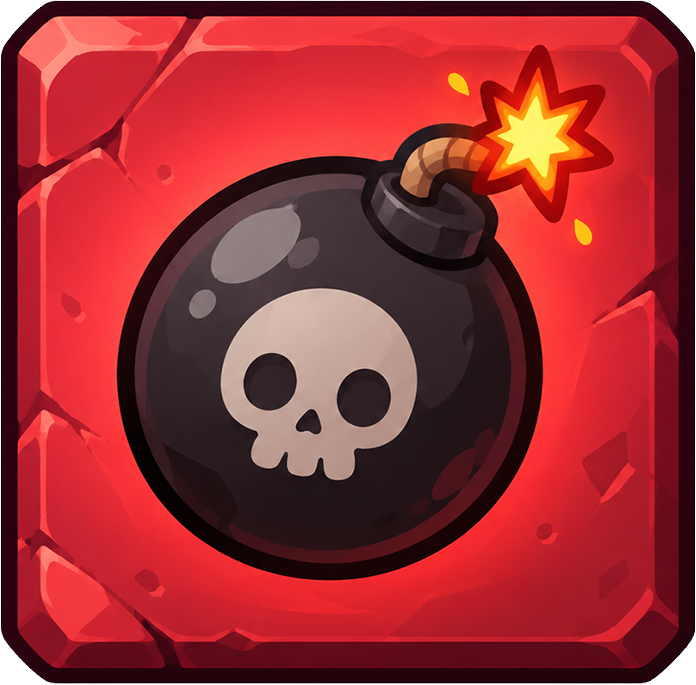

# MineOne

  

## Minesweeper was never meant to be this competitive.

>**MineOne** is a multiplayer take on Minesweeper made in Unity. Join a lobby with a friend, compete over one shared board, and try to earn the highest score before the mines catch up with you.

[Go through the project on GitHub](https://github.com/BhaskarPanja93/MineOne) · [Download the game](https://github.com/BhaskarPanja93/MineOne/releases)

## How to play

1. Enter your name, then create a lobby or join one with its code.
2. The host chooses the board size and starts the game.
3. Choose a covered cell. The number on a revealed cell tells you how many mines touch it, including diagonals. Players can choose in any order.
4. Safe reveals earn points from their number clues. A mine disqualifies the player who clicked it; everyone else keeps playing on the same board.
5. The game ends when every safe cell is uncovered or every player has been disqualified. The end screen ranks players by score.

Your first click is protected: the clicked cell and its surrounding area are kept mine-free. If you uncover an empty area, neighboring safe cells open automatically, just like classic Minesweeper. Board layouts are generated randomly, with roughly one in five eligible cells containing a mine.

## Try it
Download the .zip or .7z file from [Releases](https://github.com/BhaskarPanja93/MineOne/releases)

## Tweak it
1. Install Unity Editor `6000.6.2f1` or a compatible Unity 6 editor.
2. Clone or download this repository and open its project folder in Unity Hub.
3. In Unity, link the project to a Unity Cloud project and make sure Unity Authentication and Multiplayer Services / Relay are available. MineOne uses anonymous sign-in and Relay to create and join online sessions, so an internet connection is required.

The host can choose a board from 10×10 up to 100×100, in steps of five. The project includes a Windows build profile, but no ready-to-download build is published with the repository. A build can be made from the Unity Editor after the Unity Services setup above.

## What makes it different?

- **One shared board:** Every player sees the same clues and revealed cells, so every choice changes the board for the group.
- **Risk with a score attached:** Safe number clues add to your score; the wrong guess knocks you out.
- **A protected opening:** The first move starts in a mine-free neighborhood, giving the game room to begin.
- **Play again together:** The host can reset the round and return everyone to the lobby.

## Built with

- Unity `6000.6.2f1`
- C# and TextMesh Pro
- Netcode for GameObjects
- Unity Multiplayer Services, Authentication, and Relay

## Project map

| Path | What it does |
| --- | --- |
| `Assets/Elements/Menu/Menu.cs` | Name entry, lobby creation, and join-code entry |
| `Assets/Elements/Lobby/Lobby.cs` | Player list, board-size controls, and host start button |
| `Assets/Elements/Game/Game.cs` | Board generation, reveal and scoring rules, and in-game UI |
| `Assets/Elements/EndScreen/EndScreen.cs` | Score ranking and play-again flow |
| `Assets/Elements/SessionManager.cs` | Multiplayer session setup and shared player/game state |

## For contributors

The project is a Unity source project. Open it in the editor version above, make changes under `Assets/`, and use the included scenes to explore the menu, lobby, game, and results flow. Multiplayer changes should be tried with more than one client and a configured Unity Services project.

Found a bug or have an idea? Open an issue or start a discussion: [MineOne Issues](https://github.com/BhaskarPanja93/MineOne/issues).
